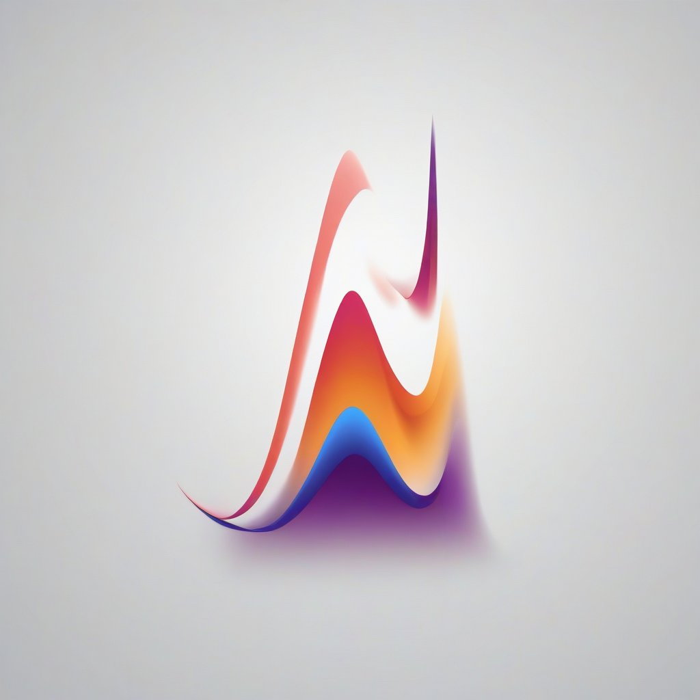

# Scratch ML: An ML framework from scratch

Machine Learning and Deep Learning framework developed from scratch in Python.

## Getting started
0. Clone this repo
1. Install nnfs
2. Install numpy
3. Run the python file "modular_fullstep.py".

Once you do it, you will see how the accuracy improves and your loss reduces; on a randomly generated dataset.

## Future plans
This project started as a way to teach ourselves how neural networks really worked; after years of writing tensorflow code, and feeling like we
wanted to have more control on how the models got trained. Because of that, we feel like scratchml is a great tool to get you started from scratch
in machine learning and deep learning topics. We are planning on providing a course to develop the framework from scratch, and let you truly learn
how neural networks and machine learning works.

In addition, we would like scratchml to be much more than a library used for learning purposes, to implement neural networks and machine learning with Python;
we feel like common frameworks like PyTorch and Tensorflow work great, but they could be much further improved; we believe there is already a lot of code that
makes it difficult to study a way to improve the implementation of separate pieces; in addition, we are planning to make it a competitive framework to run in
certain architectures and GPUs.

## Why Scratch ML?
At Daert, we felt like the best way to feel like you are doing Machine Learning from scratch, is when you import the Python libraries, and write:
"from scratchml import *" it truly felt like a way of saying "from scratch ml", and the name stuck with us.

## How to use Ralph Loop to develop on this repo:
This is a mechanism that will likely evolve in the next days; as it has changed in the last couple of days since the first working implementation.

Geoff is so right, nowadays there is a guitar to be tuned, and to try to get the most out of it. This has pretty much alway be true, but year ago or so (beginning 2025), the guitar had missing strings and it was hard to setup.

That being said, less is truly more; I cleaned up a lot of stuff and some duplicate .md files that I had, that made the system worse to work.

The results right now are surprising and motivating at the same time. Hard things like: "go build a GPT2 training script are showing all the work that needs to be added". Have into mind that this is my view from running Qwen3-Coder 30B A3B... so, it is very likely that you will get a completely different behavior with better models.

That said, this runs a multi instance of the Ralph Loop; it will use your Claude config from your root .claude, and go on.

Important files:
- PRD.md: contains the list of tasks
- AGENT.md: used by Ralph to add its own learnings
- PROMPT.md: contains the spec of the Ralph loop

You will not find a specs folder here because I have been unable to steer it to do so as the first thing yet. But hey, we are tuning the thing.

Steps to run:
claude-fleet.sh start

Then from each terminal, you use the tmux controls to do things on them: stop, give feedback to claude...

Steps to stop:
claude-fleet.sh stop

More files:
- ralph-once.sh runs ralph once
- afk-ralph.sh <X> runs ralph X times in a loop.

Recommended to add TIMEOUT=<SECONDS> before running afk-ralph.sh to set a different timeout. This is done because Qwen3 may get stuck and I need it to be killed and restart, as I wanna run this AFK:
TIMEOUT=3000 afk-ralph.sh 30
